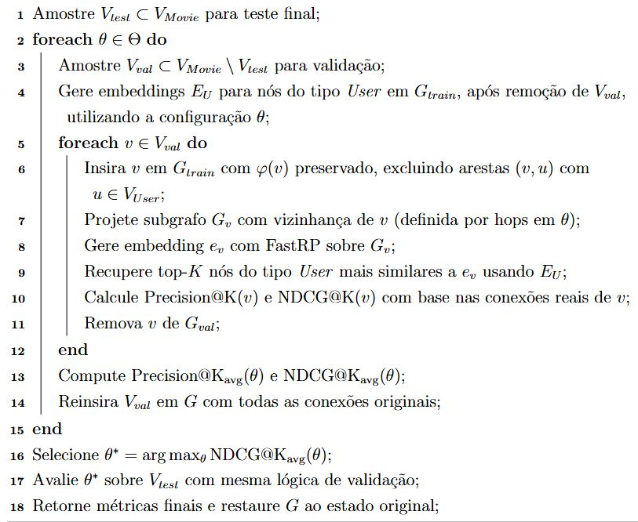

# **Abordagem do problema de cold-start, em sistemas de recomendação, como uma tarefa de completude em grafo de conhecimento**

Este repositório contém a implementação do código da dissertação de mestrado intitulada: "Abordagem do problema de cold-start, em sistemas de recomendação, como uma tarefa de completude em grafo de conhecimento", do Programa de Pós-Gradução em Ciência da Computação da UFMG. Utilizando uma estrutura leve e eficiente, a solução alcançou resultados expressivos ao recomendar itens mesmo na ausência de interações históricas, superando as métricas de Precision e NDCG do algoritmo LightFM em 30% e 130% respectivamente.

O processo de transformação do problema de cold-start de item em um problema de completude em grafo de conhecimento está descrito no algoritmo a seguir:


## Fonte de Dados
Com o objetivo de garantir que o estudo de caso apresentado nesta dissertação seja publicamente verificável e reprodutível, optou-se pela utilização de uma base de dados pública, amplamente reconhecida e adotada em pesquisas de alta qualidade na área de sistemas de recomendação. Dentre as opções viáveis, foram avaliados os conjuntos de dados disponibilizados pelo GroupLens Research:

| **Nome**   | **Faixa de data** | **Notas**     | **Qtd Usuários** | **Qtd Filmes** | **Qtd Notas** | **Rótulos** | **Densidade** |
|------------|-------------------|---------------|------------------|----------------|---------------|-------------|----------------|
| ML 100K    | 9/1997–4/1998     | 1–5 stars     | 943              | 1,682          | 100,000       | 0           | 6.30%          |
| ML 1M      | 4/2000–2/2003     | 1–5 stars     | 6,040            | 3,706          | 1,000,209     | 0           | 4.47%          |
| ML 10M     | 1/1995–1/2009     | 0.5–5 stars   | 69,878           | 10,681         | 10,000,054    | 95,580      | 1.34%          |
| ML 20M     | 1/1995–3/2015     | 0.5–5 stars   | 138,493          | 27,278         | 20,000,263    | 465,564     | 0.54%          |

Considerando este cenário foi dedicido pela utilização do dataset MovieLens 100k. Embora seja o menor entre os conjuntos analisados, o Mo-
vieLens 100k mantém a representatividade necessária para simular o problema de recomendação de novos itens, ao mesmo tempo em que simplifica a aplicação dos métodos propostos, reduzindo o custo computacional e facilitando a reprodutibilidade dos experimentos. Essa escolha permite validar a abordagem em um ambiente controlado, preservando as características estruturais dos sistemas reais, como a esparsidade e a diversidade
de perfis de usuários.

## Estrutura da Aplicação
**Ambiente de Execução**: A aplicação, bem coma todas as bibliotecas definidas em *requirements.txt*, foi construída sobre a seguinte estrutura:
- Python 3.10.7
- Neo4j Community 5.26.3
- Neo4j Graph Data Science 2.13.2
- OpenJDK 21

**Processamento dos Dados e Construção do Graph DB**:
- **src/data_spliter.py**: Faz download dos dados do MovieLens 100k e transforma a estrutura dos dados para otimizar o processo de construção do grafo de conhecimento.

- **src/graph_builder.py**: Realiza carga em um banco de dados em grafo Neo4j, a partir dos dados processados anteriormente.

**Implementação da completude em grafo de conhecimento**:
- **src/node_handler.py**: Classes para manipulação do nós do grafo, através de operações de escrita, deleção e atualização de nós e relacionamentos.

- **src/embedding_handler.py**: Classes para criação de embeddings dos nós do grafo, através de algoritmos implementados na lib Graph Data Science.

- **src/vector_search_handler.py**: Classes para implementação de busca vetorial através de diferentes métricas de similaridade.

- **src/metrics_handler.py**: Classes para calcular e reportar as métricas de qualidade em ranqueamento Precision@k e NDCG@k para diferentes valores de k.

**Implementação do algoritmo LightFM para cold-strat**:
- **notebooks/lightfm_model.ipynb**: Implementação do algoritmo LightFM para atuar como método convencional de resolução do probpema de cold start, permitindo a comparação dos resultados de Precision@k e NDCG@K com o método proposto neste trabalho.


## Referência
Se você achou este trabalho útil, por favor considere citar:
```bibtex
@misc{cold-start-as-graph-completion,
      title={Abordagem do problema de cold-start, em sistemas de recomendação, como uma tarefa de completude em grafo de conhecimento}, 
      author={José Walter de Lima Mota},
      year={2025},
      eprint={},
      archivePrefix={},
      primaryClass={},
      url={}, 
}
